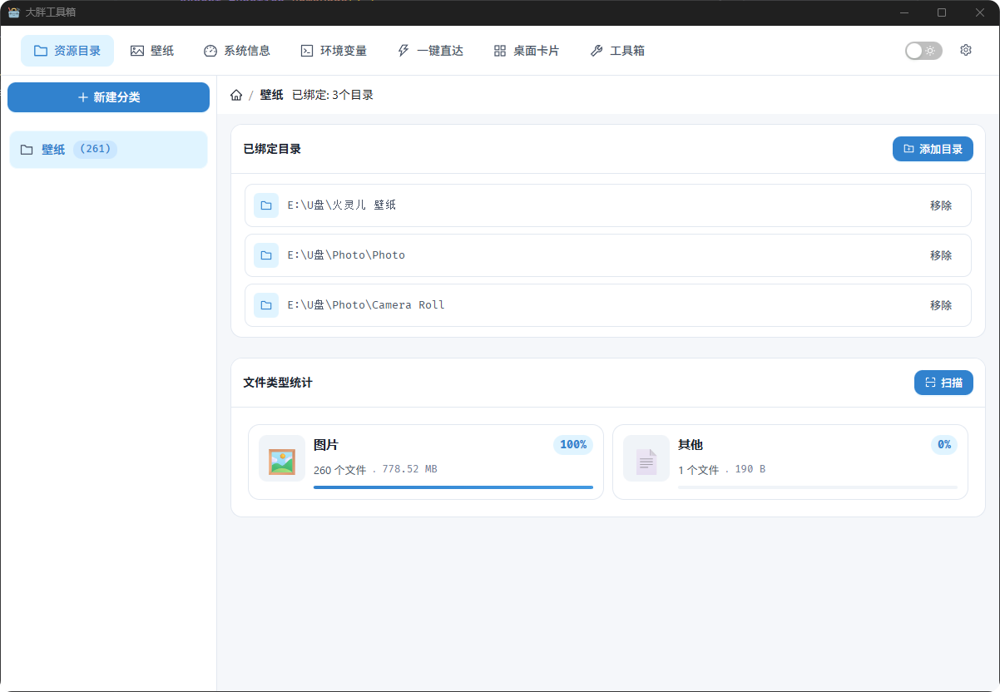
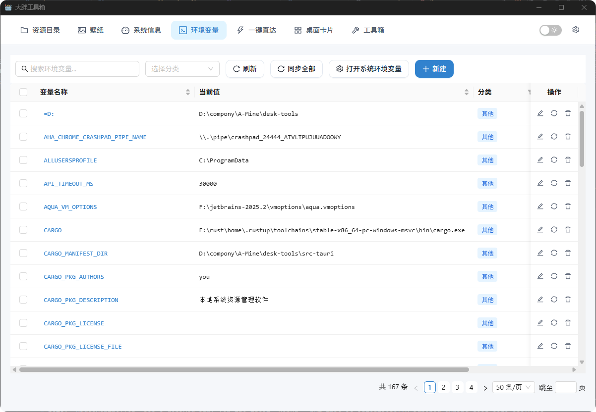

# 大胖工具箱

一个桌面资源管理工具集，提供文件管理、壁纸切换、系统信息、环境变量管理、桌面卡片等多种实用功能。

## 目录

- [技术栈](#技术栈)
- [项目目录结构](#项目目录结构)
- [功能模块介绍](#功能模块介绍)
- [环境配置要求](#环境配置要求)
- [项目运行步骤](#项目运行步骤)
- [常见问题](#常见问题)
- [联系方式](#联系方式)

---

## 技术栈

<div align="center">

### 前端技术

| 技术名称 | 版本 | 用途 |
| :--- | :--- | :--- |
| **React** | 18.3.1 | 核心框架 |
| **TypeScript** | 5.5.3 | 类型检查 |
| **Vite** | 5.3.1 | 构建工具 |
| **React Router DOM** | 7.12.0 | 路由管理 |
| **Ant Design** | 6.2.1 | UI组件库 |
| **Zustand** | 5.0.10 | 状态管理 |
| **TanStack Query** | 5.90.19 | 数据请求 |
| **@dnd-kit/core** | 6.3.1 | 拖拽功能 |
| **react-window** | 2.2.5 | 虚拟滚动 |
| **Recharts** | 3.7.0 | 图表组件 |
| **Tailwind CSS** | 4.1.18 | CSS框架 |
| **SCSS** | - | 样式预处理器 |

### 后端技术

| 技术名称 | 版本 | 用途 |
| :--- | :--- | :--- |
| **Tauri** | 2.0 | 桌面应用框架 |
| **Rust** | Edition 2021 | 后端语言 |
| **Tokio** | 1.x | 异步运行时 |
| **SQLite** | rusqlite 0.29 | 数据库 |

</div>
---

## 项目目录结构

```
desk-tools/
├── src/                          # 前端源代码
│   ├── pages/                     # 页面组件
│   │   ├── HomePage.tsx           # 资源目录管理主页
│   │   ├── SettingsPage.tsx       # 系统配置页面
│   │   ├── QuicklyGoPage.tsx      # 一键直达页面
│   │   ├── WidgetPage.tsx         # 小组件页面
│   │   ├── DesktopCardsPage.tsx   # 桌面卡片页面
│   │   ├── SystemInfoPage.tsx     # 系统信息页面
│   │   ├── EnvVarPage.tsx         # 环境变量管理页面
│   │   └── ToolboxPage.tsx       # 工具箱页面
│   ├── components/                 # 可复用组件
│   │   ├── cards/               # 桌面卡片相关组件
│   │   ├── wallpaper/            # 壁纸管理相关组件
│   │   ├── category/             # 分类管理组件
│   │   ├── shortcuts/            # 快捷方式组件
│   │   ├── navigation/           # 导航栏组件
│   │   └── common/              # 通用组件
│   ├── stores/                    # 状态管理
│   │   ├── settingsStore.ts       # 系统设置状态
│   │   ├── categoryStore.ts       # 分类管理状态
│   │   ├── resourceStore.ts      # 资源管理状态
│   │   └── wallpaperStore.ts     # 壁纸管理状态
│   ├── api/                      # API接口封装
│   │   └── directory.ts         # 目录操作API
│   ├── hooks/                    # 自定义React Hooks
│   │   └── useTheme.ts          # 主题切换Hook
│   ├── types/                    # TypeScript类型定义
│   ├── styles/                   # 全局样式文件
│   │   ├── main.scss            # 主样式文件
│   │   └── variables.scss       # CSS变量定义
│   ├── utils/                    # 工具函数
│   └── App.tsx                  # 应用根组件
├── src-tauri/                   # 后端源代码
│   ├── src/
│   │   ├── commands/            # Tauri命令定义
│   │   │   ├── category.rs       # 分类相关命令
│   │   │   ├── directory.rs      # 目录扫描命令
│   │   │   ├── wallpaper.rs      # 壁纸管理命令
│   │   │   ├── system.rs        # 系统信息命令
│   │   │   ├── env_var.rs       # 环境变量命令
│   │   │   ├── shortcuts.rs      # 快捷方式命令
│   │   │   ├── cards.rs         # 桌面卡片命令
│   │   │   └── window.rs        # 窗口管理命令
│   │   ├── services/            # 业务逻辑服务
│   │   │   ├── category.rs       # 分类服务
│   │   │   ├── directory.rs      # 目录扫描服务
│   │   │   └── wallpaper.rs     # 壁纸服务
│   │   ├── db/                 # 数据库层
│   │   │   ├── mod.rs          # 数据库模块
│   │   │   └── models.rs       # 数据模型定义
│   │   ├── models/              # 数据模型
│   │   ├── gpu/                # GPU信息获取
│   │   ├── error.rs            # 错误处理
│   │   └── main.rs            # Rust主入口
│   ├── Cargo.toml              # Rust依赖配置
│   └── tauri.conf.json       # Tauri配置文件
├── images/                     # 项目截图资源
│   ├── 资源目录.png          # 资源目录功能截图
│   ├── 壁纸.png              # 壁纸管理功能截图
│   ├── 桌面卡片.png          # 桌面卡片功能截图
│   ├── 环境变量.png          # 环境变量管理截图
│   ├── 系统信息.png          # 系统信息展示截图
│   └── 一键直达.png          # 一键直达功能截图
├── public/                     # 静态资源
├── package.json               # Node.js依赖配置
├── tsconfig.json            # TypeScript配置
├── vite.config.ts          # Vite构建配置
└── README.md               # 项目说明文档
```

---

## 功能模块介绍

### 1. 资源目录管理



**功能说明：**
- 创建和管理文件分类
- 绑定本地目录到分类
- 扫描目录并统计文件类型
- 支持拖拽排序分类
- 支持置顶分类
- 扫描时支持忽略指定目录（如 node_modules、.git 等）

**主要特性：**
- 分批扫描大量文件，避免页面卡顿
- 实时显示扫描进度
- 按文件类型统计（图片、文档、视频、音频、压缩包等）
- 显示文件数量和总大小
- 支持打开目录到资源管理器

### 2. 壁纸管理


**功能说明：**
- 本地壁纸库管理
- 在线壁纸浏览和下载
- 壁纸预览和应用
- 支持多显示器设置
- 壁纸分类管理

**主要特性：**
- 高质量壁纸预览
- 支持在线壁纸站
- 批量导入本地壁纸
- 壁纸缩略图生成
- 一键设置壁纸

### 3. 桌面卡片


**功能说明：**
- 创建桌面悬浮卡片
- 系统信息卡片（CPU、内存、GPU）
- 实用工具卡片（计算器、日历、时钟）
- 自定义卡片内容
- 卡片拖拽和位置管理

**主要特性：**
- 实时系统监控
- 多种卡片类型
- 自定义卡片样式
- 支持透明度和缩放
- 卡片窗口独立管理

### 4. 环境变量管理



**功能说明：**
- 查看系统环境变量
- 添加自定义环境变量
- 编辑和删除环境变量
- 环境变量分类管理
- 快速搜索和过滤

**主要特性：**
- 支持用户级和系统级变量
- 变量值验证
- 批量操作支持
- 变量同步功能
- 安全的密码保护

### 5. 系统信息


**功能说明：**
- 显示完整的系统硬件信息
- CPU信息（型号、核心数、频率）
- 内存信息（总量、可用量）
- GPU信息（型号、显存、驱动）
- 磁盘信息（容量、使用率）
- 网络信息（IP地址、MAC地址）

**主要特性：**
- 实时硬件监控
- 详细的GPU信息（支持NVIDIA）
- 多显示器信息
- 操作系统信息
- 硬件温度监控

### 6. 一键直达


**功能说明：**
- 创建快捷方式
- 快速访问常用文件、文件夹、网站
- 支持密码保护
- 快捷方式分类管理
- 网站元数据自动获取

**主要特性：**
- 支持文件、文件夹、网站快捷方式
- 自动获取网站图标和标题
- 全局密码保护
- 拖拽排序
- 快速搜索

### 7. 系统配置

**功能说明：**
- 主题设置（清新蓝、自然绿、优雅紫）
- 日间/夜间模式切换
- 关闭行为设置（退出/最小化到托盘）
- 开机启动配置
- 扫描忽略目录设置

**主要特性：**
- 三种预设主题
- 跟随系统主题
- 设置自动保存
- 托盘图标支持
- 系统权限管理

---

## 环境配置要求

### 开发环境

- **操作系统**: Windows 11 (仅支持Windows平台)
- **Node.js**: 18.x 或更高版本
- **pnpm**: 8.x 或更高版本
- **Rust**: 1.70 或更高版本
- **Git**: 最新版本

### 生产环境

- **操作系统**: Windows 11
- **无需额外运行时环境**（Tauri应用自带所有依赖）

### 开发工具推荐

- **IDE**: Visual Studio Code
- **VSCode插件**:
  - ESLint
  - Prettier
  - Tauri
  - Rust Analyzer

---

## 项目运行步骤

### 1. 克隆项目

```bash
git clone <repository-url>
cd desk-tools
```

### 2. 安装依赖

#### 安装前端依赖

```bash
pnpm install
```

#### 安装后端依赖（自动）

Tauri会自动处理Rust依赖，无需手动安装。

### 3. 开发环境运行

#### 启动开发服务器

```bash
pnpm tauri:dev
```

这将同时启动：
- Vite开发服务器（前端）
- Tauri开发服务器（后端）
- 自动重新编译和热重载

#### 单独运行前端

```bash
pnpm dev
```

访问地址: `http://localhost:5173`

### 4. 生产环境构建

#### 构建应用

```bash
pnpm tauri:build
```

构建产物位于: `src-tauri/target/release/bundle/`

#### 仅构建前端

```bash
pnpm build
```

### 5. 代码检查和格式化

#### 运行ESLint检查

```bash
pnpm lint
```

#### 格式化代码

```bash
pnpm format
```

### 6. 环境变量配置（可选）

如果需要配置开发环境变量，创建 `.env` 文件：

```env
# API配置
API_BASE_URL=http://localhost:3000

# 其他配置
LOG_LEVEL=debug
```

---

## 常见问题

### Q1: 运行 `pnpm install` 时出现网络错误

**解决方案：**
1. 检查网络连接
2. 配置国内npm镜像源：
   ```bash
   pnpm config set registry https://registry.npmmirror.com
   ```
3. 清除缓存后重试：
   ```bash
   pnpm store prune
   ```

### Q2: Rust编译失败

**解决方案：**
1. 确保Rust版本正确：
   ```bash
   rustc --version
   ```
2. 更新Rust工具链：
   ```bash
   rustup update
   ```
3. 检查系统是否安装了Visual Studio Build Tools

### Q3: Tauri开发服务器启动失败

**解决方案：**
1. 确保端口5173未被占用
2. 关闭防火墙或添加例外
3. 以管理员权限运行终端
4. 清理Tauri缓存：
   ```bash
   pnpm tauri clean
   ```

### Q4: 扫描大量文件时页面卡顿

**解决方案：**
- 已实现分批扫描功能，每批处理1000个文件
- 在系统配置中设置扫描忽略目录，跳过不需要扫描的目录
- 确保使用最新版本

### Q5: 壁纸无法设置

**解决方案：**
1. 检查壁纸文件格式（支持jpg、png、bmp等）
2. 确保有足够的磁盘权限
3. 检查Windows主题设置是否允许第三方应用更改壁纸

### Q6: 桌面卡片不显示

**解决方案：**
1. 检查是否启用了桌面小部件功能
2. 确保Windows桌面小部件服务已启用
3. 检查显卡驱动是否支持硬件加速

### Q7: 环境变量修改不生效

**解决方案：**
1. 需要重启应用或注销并重新登录
2. 某些系统变量需要管理员权限
3. 检查变量名是否与系统变量冲突

### Q8: 构建后的应用无法运行

**解决方案：**
1. 确保安装了Visual C++ Redistributable
2. 检查Windows Defender是否误报
3. 以管理员权限运行应用
4. 查看日志文件获取详细错误信息

---

## 开发规范

### 代码风格

- 使用TypeScript进行类型检查
- 遵循ESLint规则
- 使用Prettier格式化代码
- 函数必须添加注释说明功能、参数、返回值

### Git提交规范

```
<type>(<scope>): <subject>

<body>

<footer>
```

**type类型：**
- `feat`: 新功能
- `fix`: 修复bug
- `docs`: 文档更新
- `style`: 代码格式调整
- `refactor`: 重构
- `perf`: 性能优化
- `test`: 测试相关
- `chore`: 构建/工具相关

### 分支管理

- `main`: 主分支，保持稳定
- `develop`: 开发分支
- `feature/*`: 功能分支
- `bugfix/*`: 修复分支

---

## 联系方式

### 项目维护者

- **作者**: wfl
- **项目地址**: [GitHub Repository]

### 技术支持

- **问题反馈**: 请在GitHub Issues中提交
- **功能建议**: 欢迎提交Feature Request
- **贡献代码**: 欢迎提交Pull Request

### 许可证

本项目采用 MIT 许可证，详见 LICENSE 文件。

---

## 更新日志

### v1.0.0 (2026-02-06)

**新增功能：**
- 资源目录管理
- 壁纸管理系统
- 桌面卡片功能
- 环境变量管理
- 系统信息展示
- 一键直达功能
- 系统配置中心

**优化：**
- 分批扫描大量文件，避免页面卡顿
- 实时显示扫描进度
- 支持扫描忽略目录

**技术栈：**
- 前端：React + TypeScript + Ant Design
- 后端：Tauri + Rust
- 数据库：SQLite

---

## 致谢

感谢以下开源项目的支持：

- [Tauri](https://tauri.app/) - 跨平台桌面应用框架
- [Ant Design](https://ant.design/) - React UI组件库
- [React](https://react.dev/) - 前端框架
- [Rust](https://www.rust-lang.org/) - 系统编程语言

---

**最后更新**: 2026-02-06
**文档版本**: 1.0.0
